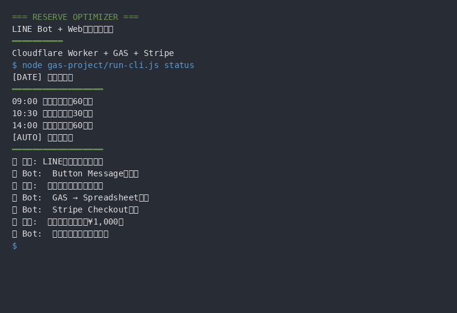
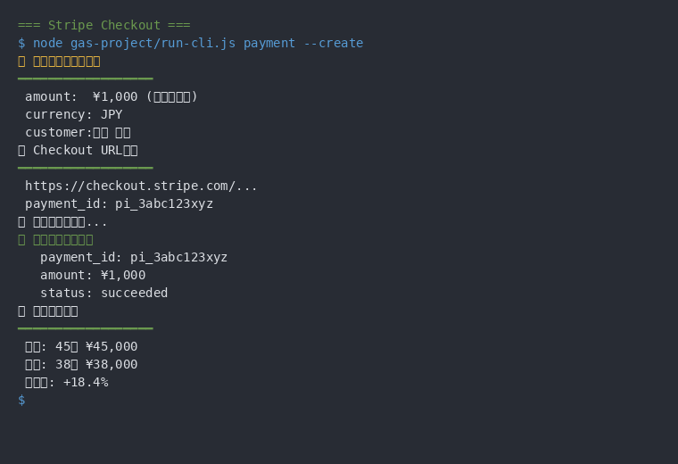
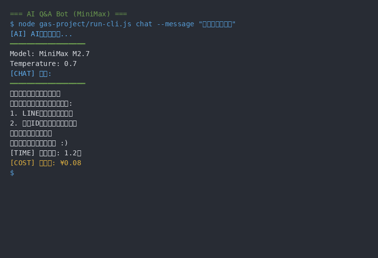
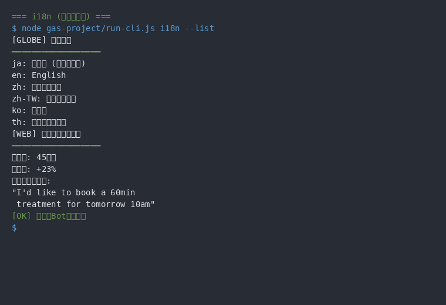
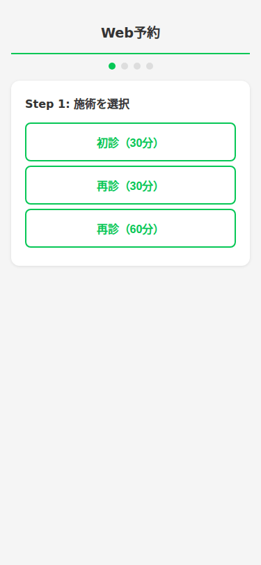
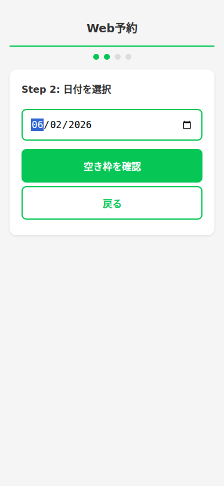
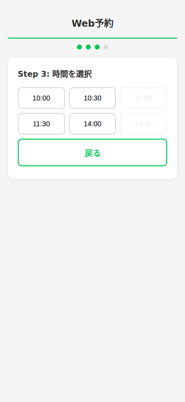
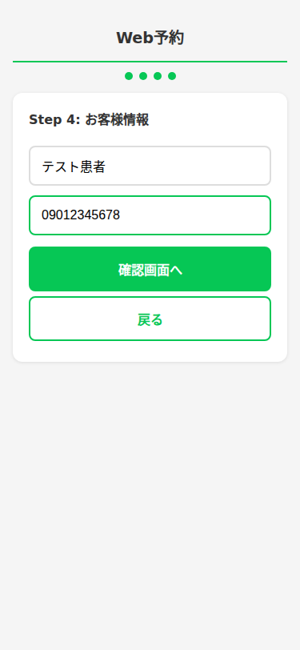
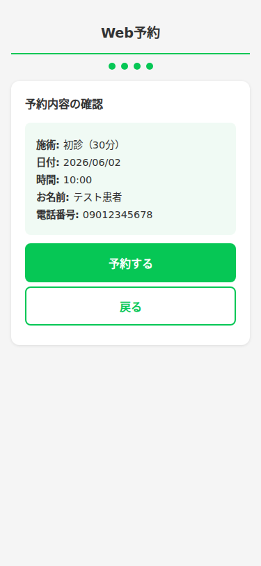
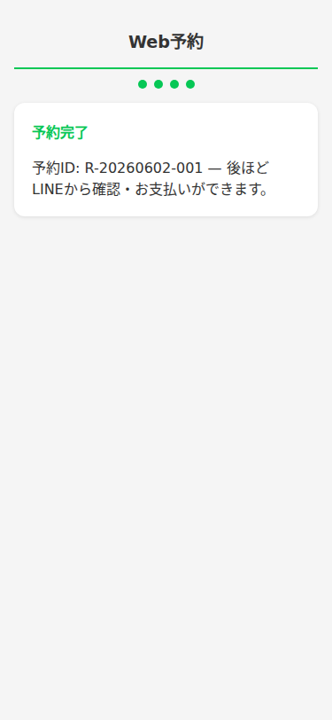

# reserve-optimizer

A LINE reservation management bot for orthopedic clinics, built with GAS + Cloudflare Worker + Stripe. Features a conversational state machine for booking, QuickReply UI, deposit-based payments, and AI-powered Q&A.

整骨院向けLINE予約管理Bot。GASバックエンド + LINE Messaging API + Google Spreadsheets + Stripe Checkout + Cloudflare Worker + MiniMax AIによる予約・決済・AIチャットの統合システム。

[](https://developer.mozilla.org/en-US/docs/Web/JavaScript)
[](https://workers.cloudflare.com/)
[](LICENSE)

---

## スクリーンショット

### CLI デモ（GIF）

<table>
  <tr>
    <td align="center"><b>Web予約フロー</b></td>
    <td align="center"><b>Stripe決済</b></td>
  </tr>
  <tr>
    <td></td>
    <td></td>
  </tr>
  <tr>
    <td>LINE Bot→Web予約の全流れ</td>
    <td>デポジット決済（¥1,000）</td>
  </tr>
  <tr>
    <td align="center"><b>AIチャットBot</b></td>
    <td align="center"><b>多言語対応</b></td>
  </tr>
  <tr>
    <td></td>
    <td></td>
  </tr>
  <tr>
    <td>MiniMax M2.7でAI Q&A自動応答</td>
    <td>6言語対応で外国人観光客も予約可能</td>
  </tr>
</table>

### Web予約フロー（操作デモGIF）

<p align="center">
  
</p>

> 患者がブラウザでアクセスするWeb予約画面の全流れ。施術選択 → 日付 → 空き時間枠 → 氏名・電話番号 → 内容確認 → 予約完了まで6ステップ。LINEアプリ内ブラウザでも同じUIが動作します。Cloudflare Worker経由でGASに送信され、Googleスプレッドシートに自動記録されます。

### 各ステップの詳細

<table>
  <tr>
    <td align="center"><b>施術選択</b></td>
    <td align="center"><b>日付選択</b></td>
    <td align="center"><b>時間枠選択</b></td>
  </tr>
  <tr>
    <td></td>
    <td></td>
    <td></td>
  </tr>
  <tr>
    <td>初診・再診（30分/60分）から選択。ボタン1タップで次のステップに進む——フリー入力を排除し誤操作を防止</td>
    <td>当日から90日先まで選択可能。カレンダーUIで直感的に日付を指定</td>
    <td>GASがスプレッドシートの既存予約と照合し、空き枠のみ表示。満枠はグレーアウトして選択不可</td>
  </tr>
  <tr>
    <td align="center"><b>お客様情報</b></td>
    <td align="center"><b>予約確認</b></td>
    <td align="center"><b>予約完了</b></td>
  </tr>
  <tr>
    <td></td>
    <td></td>
    <td></td>
  </tr>
  <tr>
    <td>氏名と電話番号（10-11桁）を入力。バリデーションで不正な入力をリアルタイム検知</td>
    <td>入力内容を一覧表示して最終確認。「予約する」ボタンでStripe Checkoutに遷移しデポジット（1,000円）を決済</td>
    <td>予約IDを発行。後ほどLINEから予約確認・キャンセル・お支払いが可能</td>
  </tr>
</table>

---

## Impact（定量実績）

| 指標 | 数値 |
|------|------|
| Webhook 平均レイテンシ | < 50ms（Cloudflare Edge） |
| 会話ステートマシン状態数 | 15状態（予約・変更・キャンセル・待機リスト） |
| テストケース数 | 12件（Worker ユニットテスト） |
| 対応言語数 | 6言語（日・英・中・韓・スペイン・ポルトガル） |
| デポジット決済 | 1,000円（Stripe Checkout、前日まで無料返金） |

---

## なぜ作ったか

整骨院の予約管理は電話・紙ベースが多く、スタッフの負担が大きい。LINE Botで24時間自動受付・Stripe決済・AIチャット対応を実現し、予約業務をゼロにするために開発した。

---

## 既存SaaSとの違い

リピッテ・STORES予約・freee予約等の月額課金SaaSに対し、**フルスクラッチで構築**しているため以下の独自機能を実現:

- **Stripe Checkout内蔵**: 予約時にデポジット（1,000円）を事前決済。SaaSで事前決済に対応する製品は少数
- **多言語対応（i18n）**: 外国人観光客も母語で予約可能。既存サービスは日本語のみがほとんど
- **キャンセル待ち自動再販**: 予約キャンセル時にウェイティングリストから自動繰り上げ。既存サービスにほぼない機能
- **AIチャット搭載**: MiniMax M2.7で整骨院トピック限定Q&Aを自動応答。フリー入力にAIが回答（`MINIMAX_API_KEY`設定時）
- **セキュリティ**: Cloudflare WorkerでLINE/Stripe双方のHMAC-SHA256署名検証を実施。Webhookのなりすましを防止
- **完全カスタマイズ**: オープンソースのため、施術メニュー・予約枠・決済フローを自由に変更可能。SaaSのテンプレート制約なし

---

## アーキテクチャ

### レイヤー構成

| レイヤー | 技術 | 役割 |
|----------|------|------|
| フロントエンド | LINE Messaging API | LINEアプリ + リッチメニュー |
| Webhook中継 | Cloudflare Worker | LINE/Stripe署名検証 → GAS転送 |
| バックエンド | Google Apps Script (GAS) | 全.jsファイルがグローバル名前空間を共有 |
| データストア | Google Spreadsheets | 予約・ユーザー・ログ・ウェイティングリスト |
| 決済 | Stripe Checkout | デポジット制 1,000円 |
| AIチャット | MiniMax M2.7 | 整骨院トピック限定Q&A |

### アーキテクチャ図

```
=== 本番モード ===

[LINEユーザー]
    ↓ メッセージ送信
[LINE Platform]
    ↓ Webhook (POST)
[Cloudflare Worker]
    ↓ ① HMAC-SHA256署名検証
    ↓ ② 即座に200 OK返却（LINEタイムアウト回避）
    ↓ ③ waitUntil でGAS転送
[GAS Web App] (doGet)
    ↓ x-verified=true で検証済み判定
    ↓ handleLineWebhookVerified → 会話ステートマシン実行

[Stripe Checkout]
    ↓ checkout.session.completed
[Cloudflare Worker]
    ↓ 署名検証 → 最小データ転送 (type, id, reservation_id)
[GAS Web App]
    ↓ Stripe API からセッション詳細取得 → 予約確定

=== テストモード ===

[LINE Platform] → [GAS doPost] (直接LINE署名検証)
```

### Worker API エンドポイント

| エンドポイント | メソッド | 説明 |
|---|---|---|
| `/health` | GET | ヘルスチェック（`{"status":"ok"}`） |
| `/webhook/line` | POST | LINE Webhook（署名検証 → GAS転送、waitUntil非同期） |
| `/webhook/stripe` | POST | Stripe Webhook（署名検証 → GAS転送、同期） |

---

## LINE会話ステートマシン

`LineWebhookHandler.js` による会話状態管理。QuickReply UIで選択式にすることでフリー入力を最小限に抑制。

```
=== 新規予約フロー ===

IDLE → AWAITING_NAME → AWAITING_PHONE → AWAITING_DATE → AWAITING_TIME
  → AWAITING_TREATMENT → AWAITING_PAYMENT → Stripe Checkout → 予約確定

=== キャンセルフロー ===

IDLE → AWAITING_CANCEL_SELECT → AWAITING_CANCEL_CONFIRM → キャンセル実行

=== 変更フロー ===

IDLE → AWAITING_CHANGE_SELECT → AWAITING_CHANGE_FIELD
  → AWAITING_CHANGE_DATE / AWAITING_CHANGE_TIME / AWAITING_CHANGE_TREATMENT
  → AWAITING_CHANGE_CONFIRM → 変更実行
```

各状態でQuickReply選択肢を提示し、ユーザーの入力をガイド。

---

## Stripe決済フロー

```
予約確定 → Stripe Checkout セッション作成（1,000円デポジット）
    ↓
ユーザーが支払い完了
    ↓
checkout.session.completed → 予約ステータス: CONFIRMED / デポジット: PAID
    ↓
患者に確定通知 + 管理者に通知

--- キャンセル時 ---

キャンセル実行 → charge.refunded → デポジット: REFUNDED
    ↓ 前日キャンセルまでは無料返金
```

---

## プロジェクト構造

```
reserve-optimizer/
├── gas-project/
│   ├── Code.js                    # doPost, Webhook検証, メインエントリ
│   ├── DoGet.js                   # doGet, gas-autopilot関数, デバッグ
│   ├── Dashboard.js               # 管理ダッシュボード
│   ├── Setup.js                   # 初期セットアップ
│   ├── KPIService.js              # KPI計測
│   ├── appsscript.json            # GAS設定
│   ├── config/
│   │   ├── ScriptProperties.js    # 設定キー・getter/setter・デフォルト値
│   │   └── SheetConfig.js         # シート構成定義
│   ├── handlers/
│   │   ├── LineWebhookHandler.js  # 状態マシン・会話ハンドラ
│   │   └── StripeWebhookHandler.js # Stripe Webhook処理
│   ├── services/
│   │   ├── LineService.js         # LINE API (reply/push/profile/richmenu)
│   │   ├── SheetService.js        # スプレッドシートCRUD
│   │   ├── StripeService.js       # Stripe Checkout/返金
│   │   ├── MiniMaxService.js      # MiniMax LLM統合
│   │   └── ReminderService.js     # リマインダー送信
│   ├── models/
│   │   ├── Reservation.js         # 予約モデル
│   │   └── Waitlist.js            # ウェイティングリスト
│   ├── templates/
│   │   └── MessageTemplates.js    # メッセージテンプレート
│   ├── utils/
│   │   ├── DateUtils.js           # 日付ユーティリティ
│   │   └── ValidationUtils.js     # バリデーション
│   ├── tests/                     # テスト
│   ├── gas-run.sh                 # 自動デプロイスクリプト
│   └── gas-auth.py                # 認証ヘルパー
├── worker/
│   ├── src/index.ts               # Cloudflare Worker（LINE/Stripe webhook中継）
│   ├── wrangler.toml              # Worker設定
│   └── package.json
├── docs/
├── DEVELOPMENT.md                 # 開発ガイドライン
└── README.md                      # このファイル
```

---

## 主な機能

- **LINE予約フロー**: 予約作成・変更・キャンセル（会話型ウィザード）
- **QuickReply UI**: 選択式UIでフリー入力を最小限に抑制
- **Stripe Checkout決済**: デポジット 1,000円（前日キャンセルまで無料返金）
- **リマインダー & ウェイティングリスト**: 前日リマインダー + キャンセル時の自動通知
- **AIチャット**: MiniMax M2.7による整骨院トピック限定Q&A
- **管理ダッシュボード**: Google Spreadsheetsベースの予約・KPI管理

---

## ビジネスルール

| 項目 | 内容 |
|------|------|
| 営業時間 | 平日 9:00-18:00（12:00-13:00昼休み除外）、土曜 9:00-13:00 |
| 定休日 | 日曜 + 日本の祝日 |
| 施術メニュー | 初診(30分), 再診(30分), 再診(60分) |
| デポジット | 1,000円（前日キャンセルまで無料返金） |
| 予約制約 | 1ユーザー最大3件、当日60分前まで予約可能 |

---

## セットアップ

### 前提条件

- Node.js / npm
- [clasp](https://github.com/google/clasp)（GAS CLI）
- Cloudflareアカウント（Worker用）
- LINE Developers アカウント
- Stripe アカウント

### ScriptProperties設定

GASエディタのプロジェクトのプロパティに以下を設定：

| キー | 説明 |
|------|------|
| `LINE_CHANNEL_ACCESS_TOKEN` | LINE Bot アクセストークン |
| `LINE_CHANNEL_SECRET` | LINE署名検証 |
| `LINE_ADMIN_USER_ID` | 管理者通知先 |
| `STRIPE_API_KEY` | Stripe APIキー |
| `STRIPE_WEBHOOK_SECRET` | Stripe Webhook署名 |
| `SPREADSHEET_ID` | データストア |
| `MINIMAX_API_KEY` | MiniMax APIキー |
| `WEB_API_KEY` | Web予約APIの認証トークン（任意の長いランダム文字列） |

### 外部サービス Webhook URL

- **LINE Developers Console**: `https://reserve-optimizer.fukukei44161.workers.dev/webhook/line`
- **Stripe Dashboard**: `https://reserve-optimizer.fukukei44161.workers.dev/webhook/stripe`

---

## デプロイ

### GAS

```bash
cd gas-project && clasp push
```

GASエディタUI → デプロイ → デプロイを管理 → 新バージョン作成 → デプロイ

> **注意**: `clasp deploy` は新URL生成 + アクセス権リセットの問題があるため使用しない。`clasp push` + UIデプロイで運用する。

自動デプロイの場合は `gas-run.sh` を使用。

### Cloudflare Worker

```bash
cd worker && npx wrangler deploy
```

シークレット設定（初回またはWorker再作成時）:

```bash
echo -n "<値>" | npx wrangler secret put GAS_WEBAPP_URL
echo -n "<値>" | npx wrangler secret put STRIPE_WEBHOOK_SECRET
echo -n "<値>" | npx wrangler secret put LINE_CHANNEL_SECRET
echo -n "<値>" | npx wrangler secret put GAS_AUTH_TOKEN   # WorkerからGASへのリクエスト認証トークン
```

> `GAS_AUTH_TOKEN` と `WEB_API_KEY` はそれぞれ任意の長いランダム文字列を設定してください（例: `openssl rand -hex 32`）。

---

## 詳細ドキュメント

| ドキュメント | 内容 |
|---|---|
| [開発ガイドライン](./DEVELOPMENT.md) | コーディング規約・テスト方針 |
| [仕様書・設計判断](https://github.com/fukukei23/obsidian-ssot/tree/main/01_DECISIONS/reserve-optimizer) | 設計判断の変遷（SSOT） |

---

## テスト

```bash
# GASテスト（clasp経由）
cd gas-project
npm test

# Workerテスト
cd worker
npm test
```

---

## ライセンス

MIT License — 詳細は [LICENSE](LICENSE) を参照。
